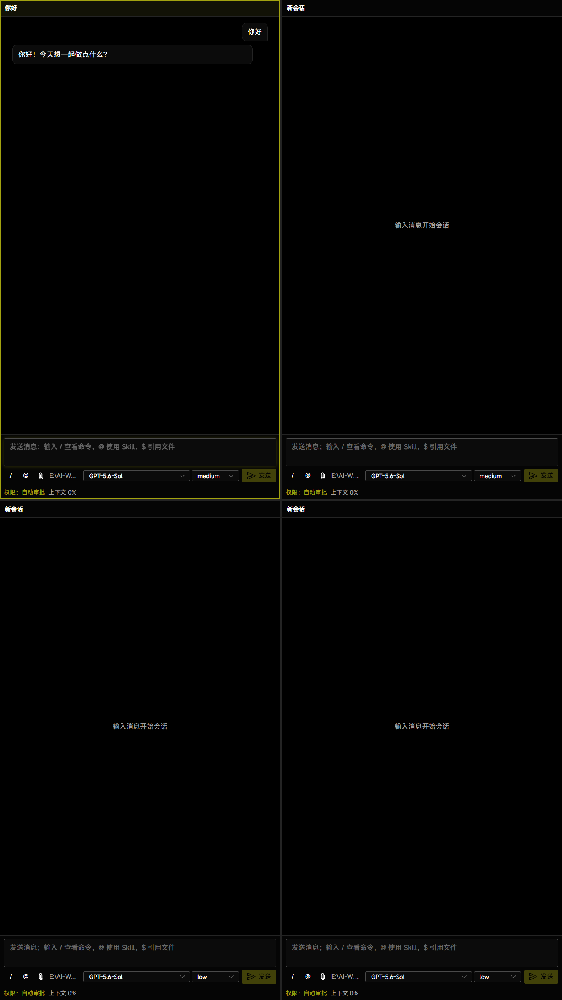
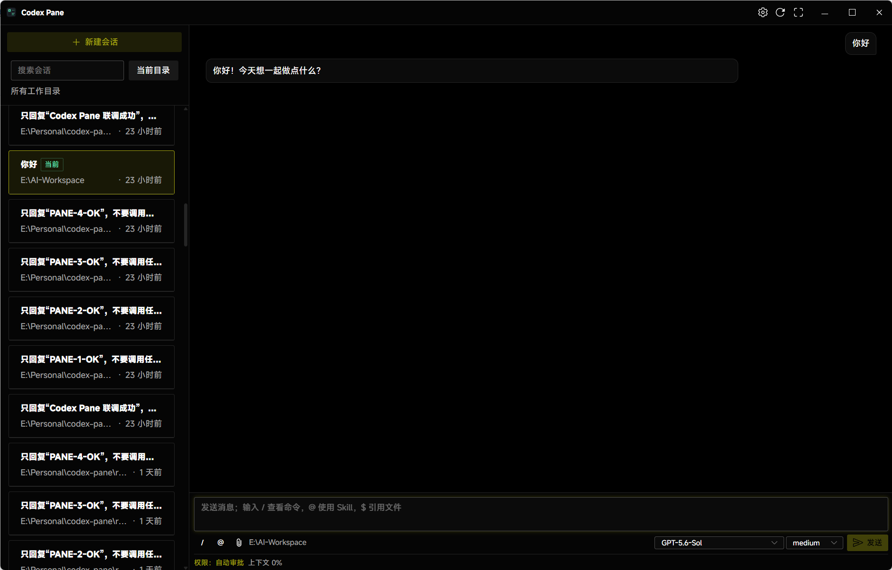

# Codex Pane

English | [简体中文](README.zh-CN.md)

Codex Pane is a Windows 11 desktop workbench for local Codex sessions. It uses the Codex CLI already installed on your computer.

## Screenshots

### Multi-Pane

Run several independent sessions in one window. Each pane has its own session, working directory, model, reasoning effort, and permission state.



### Session Sidebar

Focus on one session while browsing, searching, and switching sessions from the sidebar.



Switch modes at any time in Settings.

## Quick Start

1. Make sure `codex` works in PowerShell 7.
2. Open the `win-unpacked` directory.
3. Run `Codex Pane.exe` and choose a default working directory.

## Features

- Create, resume, rename, and switch sessions.
- Set a global default working directory or a separate directory for each pane.
- View replies, commands, diffs, tool calls, approvals, images, subagents, and background tasks.
- Use `/` for commands, `@` for Skills, and `$` for workspace files.
- Attach local files and images, or paste images directly.
- Switch models, reasoning effort, and permission modes from the composer.

Commands: `/agents`, `/cd`, `/compact`, `/fast`, `/goal`, `/mcp`, `/new`, `/permissions`, `/plan`, `/ps`, `/rename`, `/resume`, `/review`, `/skills`, `/status`, `/stop`.

Application data is stored in the `data` directory beside the application.

## Development

Requires Node.js 24 or later.

```powershell
npm install
npm run dev
npm run verify
npm run package:win
```

## License

[MIT](LICENSE)
