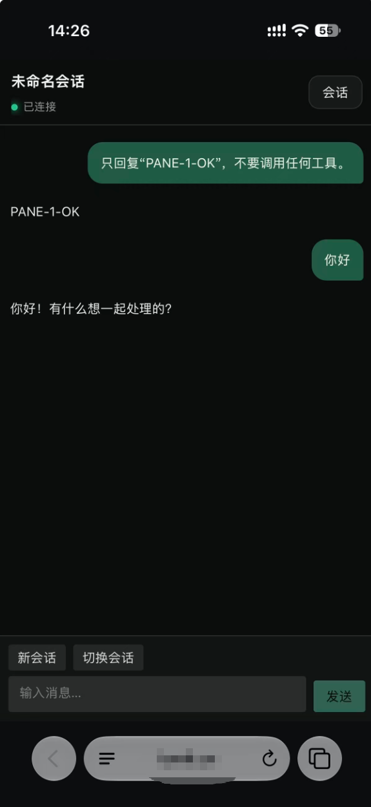

# Codex Pane

English | [简体中文](README.zh-CN.md)

Codex Pane is a Windows 11 desktop workbench built on Codex app-server. The desktop app offers multi-pane and session-sidebar layouts, while the optional self-hosted relay lets you continue conversations securely from a mobile browser.

## Quick Start

1. Make sure `codex` works in PowerShell 7.
2. Open the `win-unpacked` directory.
3. Run `Codex Pane.exe` and choose a default working directory.

## Screenshots

### Multi-Pane

Run several independent conversations in one window. Each pane has its own conversation, working directory, model, reasoning effort, and permission state.


### Session Sidebar

Focus on the current conversation while browsing, searching, and switching history from the sidebar. Switch desktop layouts at any time in Settings.


### Mobile Remote Access

Use an iPhone or another modern mobile browser to view history, create and switch conversations, send text messages, and confirm eligible command or MCP operations.



## Features

- Create, resume, rename, search, and switch conversations.
- View replies, commands, diffs, tool calls, approvals, images, subagents, and background tasks.
- Set a global or per-pane working directory, and switch models, reasoning effort, and permission modes from the composer.
- Use `/` for commands, `@` for Skills, and `$` for workspace files.
- Attach local files and images or paste images directly; successful imports are kept when part of a batch fails.
- MCP forms and choice answers are sent only after explicit submission.
- Use `F11` to enter or leave full screen; `Esc` and the top-right action also exit full screen.

## Remote Access

Remote access is optional and disabled by default. To enable it:

1. Deploy the relay by following the [remote deployment guide](remote/README.md).
2. Open Settings → Remote Access, enter the HTTPS relay address, enable remote access, and save.
3. Generate a pairing QR code and scan it with your phone.
4. Create the Passkey on the phone, verify the matching six-digit code, and confirm the phone on the desktop.

The mobile client can view, create, and switch conversations, send text messages, and provide one-time confirmation for eligible command or MCP operations. Models, permissions, working directories, file approvals, credentials, and other high-risk controls remain desktop-only.

The relay has no account database and cannot read remote messages. Phone-to-desktop messages are end-to-end encrypted, while Passkey verification and device authorization stay on the desktop.

## Built-in Commands

`/agents` · `/cd` · `/compact` · `/fast` · `/goal` · `/mcp` · `/new` · `/permissions` · `/plan` · `/ps` · `/rename` · `/resume` · `/review` · `/skills` · `/status` · `/stop`

## Data Location

Application data is stored in the `data` directory beside the application.

## Development

Requires Node.js 24 or later.

```powershell
npm install
npm run dev
npm run verify
npm run package:win
```

`package:win` creates the unpacked Windows application in `release/win-unpacked`. See [`remote`](remote) for relay and mobile development and deployment.

## License

[MIT](LICENSE)
